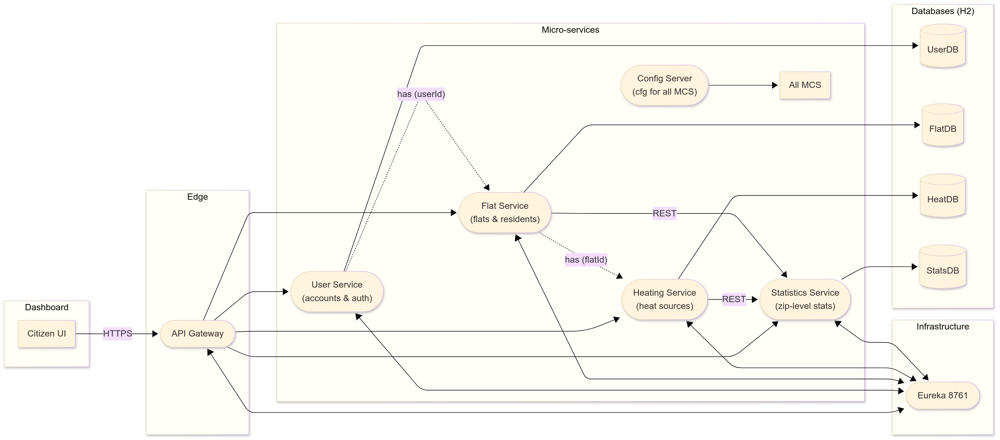

# Smart-City **Energy-Management** System  
*FH Dortmund – SEP 2025, Group 1*
- Konstantin Smirnov - 7221877
- Yanal Al Halabi - 7221683
- Onyedikachi Onah - 7221960


---

## Architecture at a Glance
| Layer            | Building Blocks (Spring Boot 3 / Cloud 2023) | Purpose |
|------------------|----------------------------------------------|---------|
| **Edge**         | **API Gateway** (Spring Cloud Gateway, port 8080) | Single entry-point, SSL termination, CORS, routing, circuit-breaking |
| **Discovery & Config** | **Eureka** (8761) • **Config Server** (8888) | Location transparency & live reload of `application.yml` profiles |
| **Micro-services** | **user-service** (8081) • **flat-service** (8082) • **heating-service** (8083) • **statistics-service** (8084) | Isolated bounded contexts, each with its own H2 database and REST API |
| **Data Stores**  | H2 (in-mem) – one schema per micro-service   | Keeps the demo self-contained & zero-setup |
| **Frontend**     | **dashboard-ui** (Vite + React)              | Citizen portal – registers flats, adds heating sources, shows live stats |

<p align="center">
  
</p>

---

## What Does Each Service Do?

| Service | Bounded Context | Responsibility | Principal Data |
|---------|-----------------|----------------|----------------|
| **user-service** | User BC | manages citizens (email, password, roles) | `USER` table |
| **flat-service** | Flat BC | CRUD for flats & residents | `FLAT`, `RESIDENT` |
| **heating-service** | Heating BC | CRUD for heating sources attached to a flat (type, kW) | `HEATING_SOURCE` |
| **statistics-service** | Statistics BC | read-model that aggregates total / average kWh & number of flats | using other DBs |

> **Integration flow**  
> `flat-service` & `heating-service` expose REST endpoints (`/api/flats/**`, `/api/heating/**`).  
> `statistics-service` calls those endpoints via Gateway, computes aggregates, and offers `/api/statistics/**` consumed by the dashboard.

### Why These Tech Choices?

* **Spring Boot 3 + Spring Cloud** – allows to easily create and manage microservices application.  
* **Eureka** – simplest service discovery that plays with Spring.  
* **Spring Cloud Gateway** – reactive, fits Boot 3, supports path-based routing and global CORS in a single place.  
* **H2** – in-memory DB, easy to implement and enough during the development stage.  
* **DDD** – clear modular boundaries (User, Flat, Heating, Stats).

---

## Domain-Driven Design Context Map

<p align="center">
  
</p>

Legend:

* **Customer/Supplier** – Flat depends on User; Heating depends on Flat.  
* **Conformist** – Statistics recieves whatever schema the upstream publishes.  

---

## Running the App

### Prerequisites
* **JDK 17**  
* **Node 18** (for the React UI)  
* Git & Maven (comes with the repo as `mvnw`)

### 1. Start infrastructure (Terminal 1)

```bash
# -- Service Registry
./mvnw -pl backend/service-registry    -am spring-boot:run
# -- Config Server (reads configs from backend/**/src/main/resources)
./mvnw -pl backend/config-server       -am spring-boot:run
```

### 2. Run API Gateway (New terminal)
```bash
./mvnw -pl backend/api-gateway         -am spring-boot:run
```
Gateway starts on http://localhost:8080 and exposes global CORS (see CorsGlobalConfig.java).

### 3. Start core services (separate terminals)
```bash
# User BC
./mvnw -pl backend/user-service        -am spring-boot:run
# Flat BC
./mvnw -pl backend/flat-service        -am spring-boot:run
# Heating BC
./mvnw -pl backend/heating-service     -am spring-boot:run
# Statistics BC
./mvnw -pl backend/statistics-service  -am spring-boot:run
```

### 4. Start the React dashboard (New terminal)
```bash
cd dashboard-ui
npm install        # first time only
npm run dev        # Vite on http://localhost:5173
```

### Quick Test
- Browse to the dashboard ➜ register / log-in a user.
- Add a flat ➜ add a heating source (Gas 10 kW).
- Statistics panel (top of the page) will instantly refresh.

### Diagrams & Further Docs
All Mermaid code and diagrams can be found in **/diagrams** folder
- architecture_code.text → Architecture diagram (architecture_SEP.png)
- DDD_code.txt → DDD context map (DDD_diagram.png)

## API Documentation
Each microservice exposes its own API documentation via Swagger UI.
After starting the services, you can access the documentation at:
- User Service: http://localhost:8081/swagger-ui.html
- Flat Service: http://localhost:8082/swagger-ui.html
- Heating Service: http://localhost:8083/swagger-ui.html
- Statistics Service: http://localhost:8084/swagger-ui.html


